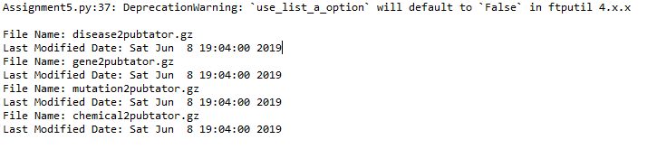

# Last-Modified-Date-for-Files
Last Modified Date for files using argparse and ftputil. This code creates a module where you must input an email in order for the program to start running. After an email is provided, the file names wanted from puptator will be specified along with the last modified date.

* If help is needed on running the code, please flag -h or --help for additional resources on how to run the program properly
* Assignment5email.py verifies that the user has inserted an email
## Ideally, the results of this py should look something like this:

